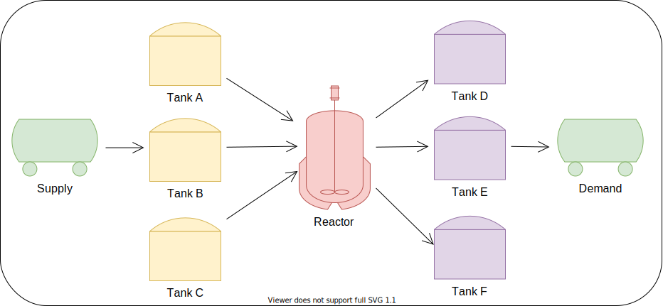

# Resource Task Network Demo

This is a demo on how to use the RTN model for process scheduling in a batch chemical plant.

## Model
See model equations in the Markdown at the top of each of the .ipynb files in the examples folder (Note: Github Markdown doesn't support LaTeX yet for me to show the formulas here)

## Example
### System Being Modeled

#### Reaction Pathways:
1 reactor can perform three different stoichiomentric reactions (50/50 ratio for reactants):
- Reaction 1: A + B -> D
- Reaction 2: A + C -> E
- Reaction 3: B + C -> F 

#### Equipment:
- Storage Tanks: each material has a dedicated storage tank with a 100 L capacity.
- Reactor: The reactor can be used to produce batches that are between 30 and 60 L.

#### External material flow:
- Raw material supply arrives at t = 6, 7, 8, 9, and 10 (10 units arrive in each time period)
- External demand of products D, E, and F occurs at t = 6, 7, 8, 9, and 10 (10 units are consumed in each period0).

#### Objective:
Find the production schedule that will satisfy the external demands and require the least number of batches.

#### RTN Structure:

